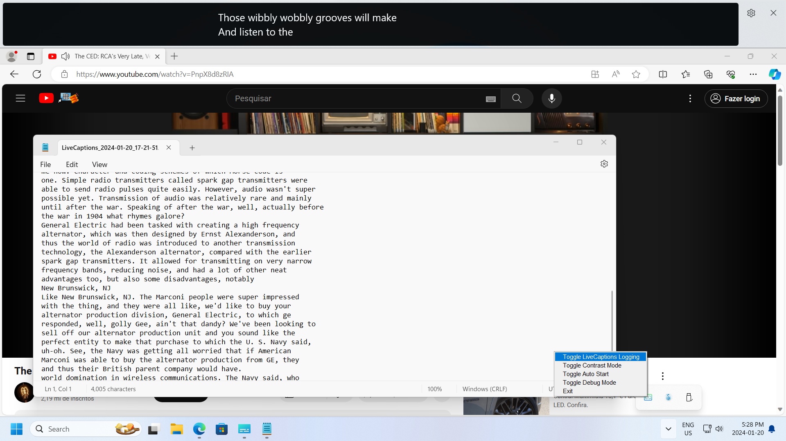

# LiveCaptionsLogger

This software was developed as a response to [this Microsoft Forums question](https://answers.microsoft.com/en-us/windows/forum/all/is-it-possible-to-save-a-transcript-of-live/3474cc04-1d34-4e51-bf99-aa7dc0e0fdd0)

Windows 11 offers a very good accessibility option called Live Captions, however, Microsoft does not offer a way for users to log a transcript of what the live captions are generating at any given moment,
these transcripts could be useful for users in a number of ways, but due to the closed source nature of Windows we would have to wait for Microsoft to come up with a solution for this, if ever.

Enter this attempt at providing rudimentary support for live caption transcriptions.


# How it Works

This small Java software relies on [Tesseract OCR](https://github.com/tesseract-ocr/tesseract) to perform an Optical Character Recognition (OCR) of the usual live captioning area each second.\
We then apply some filtering to write down only the finalized line after Windows finishes generating it.\
The lines are then written to the LiveCaptions folder inside your Documents library. Each time the captions window disappears, a new log file is generated.

# Installation

Follow these steps to install and run the program:

1. Ensure you have Java 11 or a newer version installed. We recommend using the Eclipse Temurin OpenJDK implementation, which you can download from: 
[Eclipse Temurin](https://adoptium.net/temurin/releases/)\
For Windows 11, scroll down and select the x64 JRE .msi, then download and install it.

2. If you are using Linux, ensure you have 'tesseract-ocr' installed.

3. Download the latest version of this program from the [releases page](https://github.com/hstr0100/LiveCaptionsLogger/releases).

4. Extract the contents to any directory where you would like the program to run from.

5. We provide a pre-compiled JAR of the program. Navigate to the bin/ directory and run the LiveCaptionsLogger.bat script to start the program.

6. Right-click the tray icon to set up auto-start, capture area, or toggle transcriptions on and off.

# Building

If you want to compile this program yourself:

1. Ensure you have OpenJDK 11 or a newer version installed. Please note that this requirement differs from the one needed to run precompiled binaries, which only necessitate a JRE.

2. Clone this repository:
   ```bash
   git clone https://github.com/hstr0100/LiveCaptionsLogger.git
   ```

3. Navigate to the project directory:
   ```bash
   cd LiveCaptionsLogger
   ```
   
4. Build the project using Gradle:
   ```bash
   ./gradlew clean build
   ```
   
